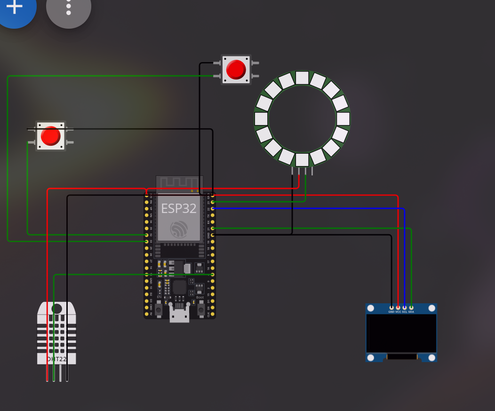

# Wetterstation mit ESP32, LCD-Display und LED-Streifen

**Betreuende Lehrkraft:** Hannes Klotz  
**Arbeitender Schüler:** Christian Vorhofer

## Einleitung des Projekts
Dieses Projekt zielt darauf ab, eine Wetterstation zu entwickeln, die sowohl externe Wetterdaten von OpenWeatherMap als auch lokale Sensordaten erfasst und anzeigt. Der Einsatz eines LED-Streifens visualisiert die Temperatur farblich und in der Helligkeit.

## Projektbeschreibung
- Aufbau der Hardware:
  - ESP32 Mikrocontroller
  - DHT22-Sensor
  - LCD-Display
  - WS2812B LED-Streifen
  - Taster
- Verbindung mit dem WLAN
- Abfrage der Wetterdaten von OpenWeatherMap
- Anzeige der Daten auf dem LCD-Display
- Steuerung des LED-Streifens basierend auf der Temperatur
- Implementierung der Tastensteuerung

## Bilder vom Schaltplan

## Ergebnisse
- Erfolgreiche Anzeige der Wetterdaten auf dem LCD-Display.
- Farbliche und Helligkeitsvisualisierung der Temperatur durch den LED-Streifen.
- Umschaltung zwischen API-Daten und lokalen Sensordaten mittels Taster.
- Anpassung der Helligkeit des LED-Streifens mittels Taster.

## Fazit
Das Projekt zeigt, wie vielseitig ein ESP32 Mikrocontroller eingesetzt werden kann, um eine funktionsreiche Wetterstation zu realisieren. Die Integration von API-Daten und lokalen Sensorwerten sowie die Visualisierung durch einen LED-Streifen machen das Projekt zu einem gelungenen Beispiel für praktische IoT-Anwendungen.
